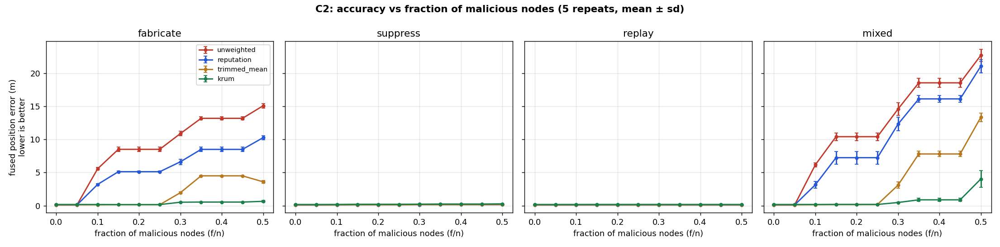
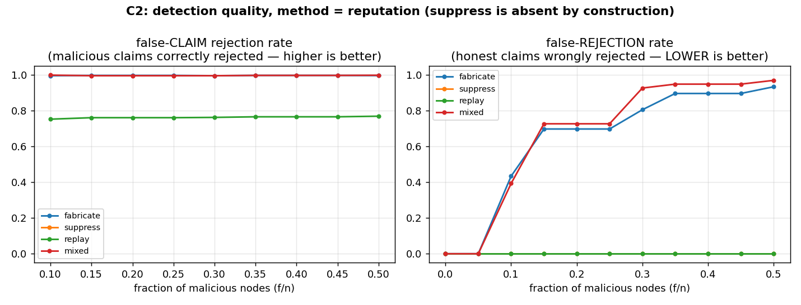
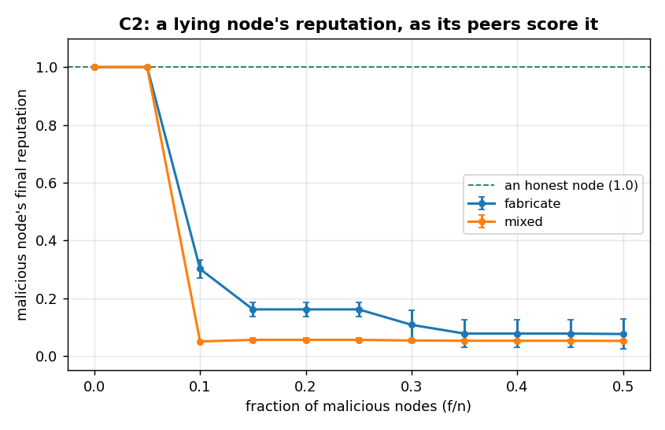

# C2 results — Byzantine robustness (WP-10)

**Status: measured.** Produced by

```
python scripts/run_byzantine_sweep.py --repeat 5 --out results/byzantine_sweep_c2
python scripts/plot_byzantine_sweep.py
```

880 runs (11 `f/n` points × 4 attack classes × 4 aggregation methods × 5
repeats) against `results/byzantine_sweep_c2/results.json`. Every number below
is computed from that file; nothing here is estimated.

**Harness scope, stated up front.** This is the synthetic WP-10 harness
described in `scripts/run_byzantine_sweep.py`'s own docstring — one person
walking a straight line, `n = 10` nodes reporting per tick, the `f` malicious
ones transformed by `starling_consensus.attacks.AttackInjector` at intensity
1.0. It is *not* a live multi-node run; it isolates claim-level plausibility
and fusion so the sweep is cheap enough to actually run (46 s at
`--repeat 1`). The live behaviour is demonstrated separately in the demo's
"lying node" moment and `tests/test_demo_integration.py`.

**Grid artifact, stated rather than hidden.** `f = round(f_over_n × 10)` with
Python's round-half-to-even, so the 11 ratio points collapse onto only **six
distinct malicious-node counts** (f = 0, 1, 2, 3, 4, 5). That is why rows
0.15/0.20/0.25 are identical, as are 0.35/0.40/0.45. The curve has six real
points, not eleven.

---

## 1. Accuracy vs f/n



### `fabricate` — fused position error (m), mean ± sd over 5 repeats

| f/n | `unweighted` | `reputation` | `trimmed_mean` | `krum` |
|---:|---:|---:|---:|---:|
| 0.00 | 0.12 ± 0.01 | 0.12 ± 0.01 | 0.12 ± 0.01 | 0.18 ± 0.01 |
| 0.05 | 0.12 ± 0.01 | 0.12 ± 0.01 | 0.12 ± 0.01 | 0.18 ± 0.01 |
| 0.10 | 5.58 ± 0.18 | 3.21 ± 0.10 | 0.13 ± 0.01 | 0.17 ± 0.01 |
| 0.15 | 8.51 ± 0.33 | 5.13 ± 0.11 | 0.15 ± 0.01 | 0.16 ± 0.01 |
| 0.20 | 8.51 ± 0.33 | 5.13 ± 0.11 | 0.15 ± 0.01 | 0.16 ± 0.01 |
| 0.25 | 8.51 ± 0.33 | 5.13 ± 0.11 | 0.15 ± 0.01 | 0.16 ± 0.01 |
| 0.30 | 10.89 ± 0.35 | 6.63 ± 0.41 | 1.96 ± 0.13 | 0.52 ± 0.03 |
| 0.35 | 13.19 ± 0.22 | 8.50 ± 0.34 | 4.51 ± 0.08 | 0.54 ± 0.02 |
| 0.40 | 13.19 ± 0.22 | 8.50 ± 0.34 | 4.51 ± 0.08 | 0.54 ± 0.02 |
| 0.45 | 13.19 ± 0.22 | 8.50 ± 0.34 | 4.51 ± 0.08 | 0.54 ± 0.02 |
| 0.50 | 15.09 ± 0.33 | 10.27 ± 0.30 | 3.60 ± 0.18 | 0.66 ± 0.11 |

### `mixed` — fused position error (m), mean ± sd over 5 repeats

| f/n | `unweighted` | `reputation` | `trimmed_mean` | `krum` |
|---:|---:|---:|---:|---:|
| 0.00 | 0.12 ± 0.01 | 0.12 ± 0.01 | 0.12 ± 0.01 | 0.18 ± 0.01 |
| 0.05 | 0.12 ± 0.01 | 0.12 ± 0.01 | 0.12 ± 0.01 | 0.18 ± 0.01 |
| 0.10 | 6.17 ± 0.29 | 3.16 ± 0.52 | 0.14 ± 0.01 | 0.18 ± 0.01 |
| 0.15 | 10.42 ± 0.58 | 7.25 ± 0.95 | 0.18 ± 0.01 | 0.18 ± 0.01 |
| 0.20 | 10.42 ± 0.58 | 7.25 ± 0.95 | 0.18 ± 0.01 | 0.18 ± 0.01 |
| 0.25 | 10.42 ± 0.58 | 7.25 ± 0.95 | 0.18 ± 0.01 | 0.18 ± 0.01 |
| 0.30 | 14.61 ± 0.95 | 12.33 ± 1.03 | 3.11 ± 0.46 | 0.48 ± 0.03 |
| 0.35 | 18.56 ± 0.66 | 16.13 ± 0.52 | 7.81 ± 0.41 | 0.88 ± 0.25 |
| 0.40 | 18.56 ± 0.66 | 16.13 ± 0.52 | 7.81 ± 0.41 | 0.88 ± 0.25 |
| 0.45 | 18.56 ± 0.66 | 16.13 ± 0.52 | 7.81 ± 0.41 | 0.88 ± 0.25 |
| 0.50 | 22.72 ± 0.93 | 21.07 ± 1.01 | 13.36 ± 0.65 | 4.03 ± 1.24 |

### `suppress` and `replay` — flat at the honest baseline

Both stay at the no-attack error (≈0.12–0.19 m) for every method at every
`f/n`. Neither is a null result, and neither is a defect:

- **`suppress`** withholds claims. Fewer honest claims are fused, but no
  *wrong* claim is introduced, so the fused position never moves. Its real
  damage (a missed crossing being read as "nobody was there") is a
  coverage-attestation matter, caught by
  `starling_attest.negative_evidence.detect_omission` — not by this harness,
  which has no attestation model. This was pre-committed in the harness
  docstring before the sweep ran.
- **`replay`** re-emits a *copy of a genuine observation* under a stale
  timestamp. The position it carries is therefore correct, so even when a
  replayed claim is admitted it cannot pull the estimate off. It is still
  detected — 76.3 % of replayed claims are rejected at f/n = 0.30 and the
  replaying node's reputation falls to 0.52 — it simply was never an
  accuracy attack in this scenario.

---

## 2. Detection: both rates, together



A rejection rate on its own is not interpretable, so both are reported
(method = `reputation`):

| f/n | fabricate: lies caught | fabricate: **honest wrongly rejected** | replay: lies caught | liar's final reputation |
|---:|---:|---:|---:|---:|
| 0.05 | NaN | 0.000 | NaN | 1.000 |
| 0.10 | 0.997 | 0.434 | 0.753 | 0.301 |
| 0.15 | 0.998 | 0.698 | 0.762 | 0.161 |
| 0.20 | 0.998 | 0.698 | 0.762 | 0.161 |
| 0.25 | 0.998 | 0.698 | 0.762 | 0.161 |
| 0.30 | 0.997 | 0.806 | 0.763 | 0.108 |
| 0.35 | 0.998 | 0.897 | 0.767 | 0.077 |
| 0.40 | 0.998 | 0.897 | 0.767 | 0.077 |
| 0.45 | 0.998 | 0.897 | 0.767 | 0.077 |
| 0.50 | 0.997 | 0.935 | 0.770 | 0.076 |

At f/n = 0.05, `round(0.05 × 10) = 0` — there is no malicious node at all, so
both "caught" columns are `NaN` (nothing to catch) and reputation stays 1.0.
That row is the honest-baseline control, not a detection failure.

Fabricated claims are caught essentially always (≈99.7 %) at every fraction.
`suppress` shows `NaN` throughout by construction — there is no claim to
reject when the attack is that no claim was sent.

---

## 3. A fabricating node's reputation



Reputation collapses immediately and stays down: 0.301 at f/n = 0.10, 0.108 at
0.30, 0.076 at 0.50, against 1.0 for an honest node. The more attackers there
are, the *lower* each one's final reputation — with more liars, more
implausible claims are scored per run, so the EWMA is driven further toward
`r_min`.

---

## 4. Where the scheme breaks

**Required statement (WP-10 Part 4 / `docs/threat_model.md` §5).**

`scripts/run_byzantine_sweep.py`'s own `_breaking_point()` computes the `f/n`
at which `reputation`-weighted aggregation stops beating `unweighted`, and
reports:

> **`breaking_point_f_over_n: null`** — reputation weighting beat the
> unweighted baseline at **every** swept fraction, up to and including
> f/n = 0.50.

That is a valid outcome, not a missing measurement. But reporting only that
would be misleading, because **the scheme does have a clear limit — it is just
not the one this metric was built to find.** Three honest qualifications:

1. **Reputation weighting is not the best defence here.** It reduces
   fabricate error by 1.5–1.7× versus unweighted (5.58 → 3.21 m at f/n = 0.10;
   15.09 → 10.27 m at 0.50), while `krum` reduces it by **21–32×** (5.58 →
   0.17 m; 15.09 → 0.66 m). `trimmed_mean` also beats it everywhere below
   f/n = 0.30. If accuracy under attack is the objective, the reputation
   weighting in the fusion step is the weakest of the three defences measured.

2. **The real failure mode is false rejection of honest nodes.** This is the
   number that actually degrades: 0.434 of honest claims wrongly rejected at
   f/n = 0.10, rising to **0.935 at f/n = 0.50**. The mechanism is a cascade —
   plausibility is scored against the last *fused* position, so once fusion is
   corrupted by attackers, honest claims start looking implausible relative to
   it and get discarded too. Past roughly f/n ≥ 0.30 the system is no longer
   being *fooled* so much as being *starved*: it rejects most of what it is
   told, by both liars and honest nodes alike.

3. **`suppress` is untested for accuracy here** and `replay` is not an
   accuracy attack in this scenario (§1). So "reputation never lost" is a
   statement about `fabricate` and `mixed` only.

**One-line summary for the checkpoint:** *reputation weighting never lost to
the unweighted baseline up to 50 % malicious nodes, and fabricated claims were
caught ~99.7 % of the time with the liar's reputation driven to 0.08 — but
robust aggregation (krum) outperformed it by more than an order of magnitude,
and beyond ~30 % malicious the honest-claim false-rejection rate (0.81 → 0.94)
becomes the binding failure, not the fused error.*

---

## 5. Reproducing

```
python scripts/run_byzantine_sweep.py --dry-run                              # list the 880-point matrix
python scripts/run_byzantine_sweep.py --repeat 5 --out results/byzantine_sweep_c2
python scripts/plot_byzantine_sweep.py                                        # regenerate the three figures
```

Runtime: ~46 s at `--repeat 1`, ~4 min at `--repeat 5` on an ordinary laptop.
Fully synthetic — no cameras, no video, no GPU, no live nodes.
