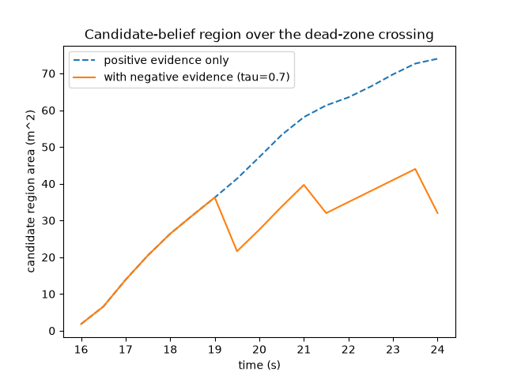
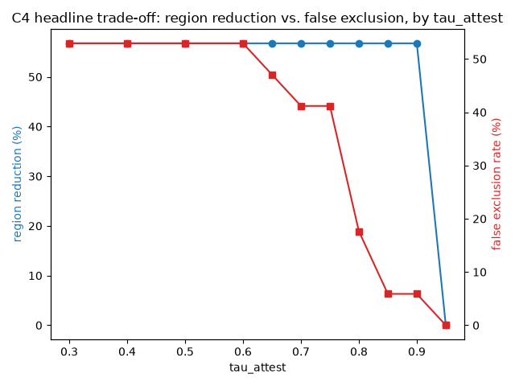

# C4 results — negative evidence over the dead-zone gap

Measured from `scripts/run_deadzone_experiment.py` (WP-09 Part 3), the
headline C4 scenario: a person walks straight through
`data/floorplan/demo_site.geojson`'s deliberate 3m camera dead zone
(x in [8.5, 11.5]) at 0.4 m/s. Numbers below are
printed directly from that harness, not estimated.

## Honest scope note

This experiment operates at the level of the negative-evidence fusion
algorithm (`starling_attest.negative_evidence.CandidateBelief`) directly —
a scripted ground-truth trajectory plus a parametrised attestation-noise
model (`P_BLIND` = 0.3, a node's self-reported confidence for a given 2s window is
drawn independently of whether it actually missed a crossing) — rather than
re-running the full perception -> coverage -> attestation pipeline over
synthetic video. `tests/test_coverage.py` and `tests/test_attestation.py`
exercise Parts 1-2 on synthetic frames directly. Reproducing this with real
multi-camera footage is the same "needs actual video" follow-up already
documented in `docs/results_c1.md`.

## Region reduction and false exclusion at tau_attest=0.7

| Metric | Value |
|---|---|
| Candidate region area, positive evidence only | 74.00 m² |
| Candidate region area, with negative evidence | 32.00 m² |
| Region reduction | 56.8% |
| **False exclusion rate (safety-critical)** | **41.2%** |
| Attestation accuracy | 87.5% (8 admitted) |

The false exclusion rate is reported prominently, not buried, per
STARLING_BUILD_STATE.md WP-09 task 7 — it is the number that matters if
this system is ever used to tell a search team where someone can't be.

## tau_attest sweep — the headline trade-off curve

STARLING_BUILD_STATE.md Appendix A.3: "a better result than any single
number" — this shows the failure mode (a low threshold admits more
attestations, including the noise model's blind-but-confident ones) rather
than a threshold tuned until the false exclusion rate looks good.

| tau_attest | region reduction | false exclusion rate | attestation accuracy | attestations admitted |
|---|---|---|---|---|
| 0.30 | 56.8% | 52.9% | 80.0% | 10 |
| 0.40 | 56.8% | 52.9% | 80.0% | 10 |
| 0.50 | 56.8% | 52.9% | 80.0% | 10 |
| 0.60 | 56.8% | 52.9% | 80.0% | 10 |
| 0.65 | 56.8% | 47.1% | 88.9% | 9 |
| 0.70 | 56.8% | 41.2% | 87.5% | 8 |
| 0.75 | 56.8% | 41.2% | 83.3% | 6 |
| 0.80 | 56.8% | 17.6% | 100.0% | 3 |
| 0.85 | 56.8% | 5.9% | 100.0% | 2 |
| 0.90 | 56.8% | 5.9% | 100.0% | 2 |
| 0.95 | 0.0% | 0.0% | 100.0% | 0 |

