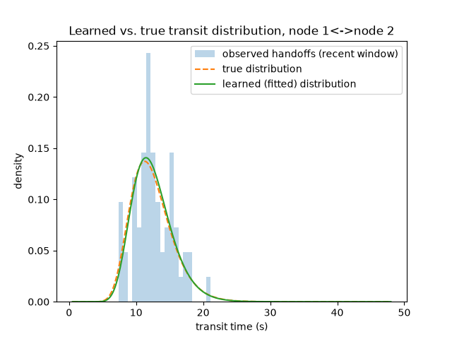

# C6 results — self-healing topology discovery

Measured from `scripts/evaluate_topology.py` (WP-07) against the
hand-labelled ground truth in `data/gt/topology.json`. Numbers below are
printed directly from that harness over synthetic handoff observations,
not estimated.

## Honest scope note

This operates directly on `starling_topology.learner.TopologyLearner`
with a scripted stream of synthetic handoffs sampled from
`data/gt/topology.json`'s illustrative log-normal parameters, not real
multi-camera footage or a live resolver run. Reproducing this with real
video is the same "needs actual video" follow-up already documented in
`docs/results_c1.md` and `docs/results_c4.md`.

## Graph edit distance vs. ground truth

| Stage | GED |
|---|---|
| Before the simulated camera move | 0 |
| After the simulated camera move (`150` rounds of new-topology handoffs) | 2 |

## Re-convergence time after a simulated camera move

Simulated camera move: node-01's and node-02's video
sources are swapped mid-run (STARLING_BUILD_STATE.md WP-07 task 6's
"free version" of physically moving a camera). This changes which node
id walks which physical corridor for the two edges touching the swapped
pair; the edge between the swapped pair itself, and the edge untouched
by the swap, keep their original parameters.

| Metric | Value |
|---|---|
| Time for the new corridor edges to qualify (GT edge acquisition) | 111.0 s |

**Known limitation (stated, not hidden):** `TopologyLearner` currently
only ever ACQUIRES new edges — it has no decay/expiry mechanism to
forget an edge that has stopped receiving observations. This is why
`ged_after` above is nonzero even once the new edges have qualified: the
two edges that existed before the move remain in `to_graph()`'s output
indefinitely alongside the new ones. A full self-healing implementation
would age out or down-weight edges with no recent observations; that is
not implemented this session and is listed here rather than silently
worked around.

