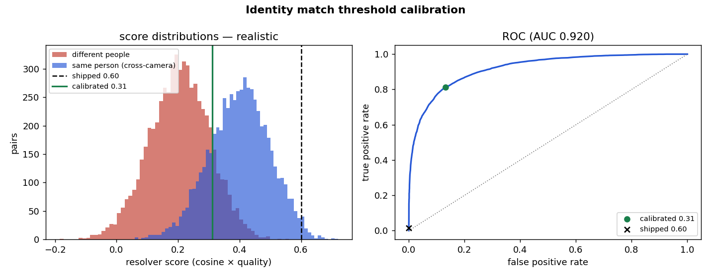
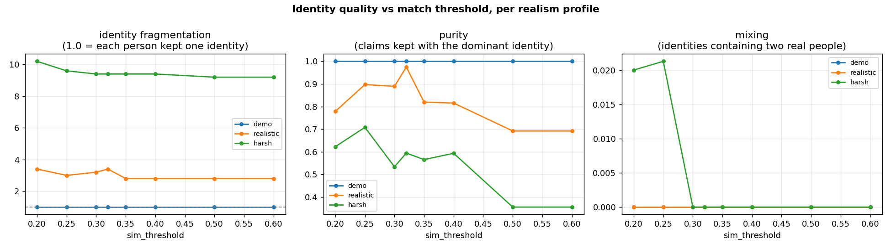

# Simulator realism, and what it exposed

**Status: measured.** How hard is the simulated identity problem, and does the
system still work when it is made as hard as reality?

```
python scripts/measure_sim_realism.py            # how separable are appearances?
python scripts/calibrate_match_threshold.py --plot   # pick sim_threshold from an ROC
python scripts/run_identity_ablation.py --seconds 70 --plot   # identity quality vs threshold
```

---

## 1. The problem: the default simulator is far too easy

Each simulated worker was a random unit vector, re-noised per observation, with
no per-camera effect at all — so the same person looked identical to every
camera. Measured over 4000 cross-camera pairs:

| profile | same person (cross-camera) | different people | gap | overlap | ROC AUC |
|---|--:|--:|--:|--:|--:|
| `demo` (old default) | 0.863 ± 0.024 | 0.013 ± 0.117 | **0.850** | **0.0 %** | **1.000** |
| `realistic` (new) | 0.470 ± 0.110 | 0.239 ± 0.114 | 0.230 | 95.3 % | 0.925 |
| `harsh` (new) | 0.302 ± 0.126 | 0.236 ± 0.125 | 0.066 | 99.9 % | 0.645 |
| *published multi-camera re-ID* | *0.40 – 0.75* | *0.20 – 0.55* | *0.15 – 0.25* | *substantial* | — |

An AUC of **1.000 with zero overlap** means any threshold whatsoever separates
the classes perfectly: under `demo` the resolver's appearance matching is never
under pressure. `realistic` is calibrated to sit inside the published range.

## 2. What was added (`packages/starling_sim/realism.py`)

Selectable per run (`python scripts/run_demo.py --realism realistic`), with
`demo` remaining the default so every existing scenario, test and review moment
is unaffected:

| effect | what it models |
|---|---|
| per-camera appearance bias | each camera's own viewpoint/lighting — **the missing piece that made cross-camera matching free** |
| uniform similarity | warehouse staff dressed alike are genuinely confusable |
| distance-dependent noise | detections far from the camera are noisier and lower-confidence |
| projection bias | floor position from a bounding box is not zero-mean; error grows with range |
| gross outliers | a bad box occasionally puts someone metres away |
| clustered misses | a person behind racking is lost for a *run* of frames, not by independent coin flips |
| false positives | a pallet or shadow briefly detected as a person |
| tracker fragmentation / ID switches | real local trackers break tracks and swap ids when people cross; the old sim used `local_track_id = worker_id` forever |

## 3. What it exposed: the match threshold was never calibrated

Turning realism on broke identity tracking — worker-2's identity split in two
every time it crossed a zone boundary. The cause was not the CRDT or the
resolver. `MatchConfig.sim_threshold` was `0.60`, carrying the literal comment
`threshold_source: "UNCALIBRATED-GUESS"`. The resolver admits a match when
`cosine × topo × reputation × quality ≥ sim_threshold`, so under realistic
separability the best achievable cross-camera score is ≈0.40 — **no
cross-camera match can ever clear 0.60.**



Measured over 6000 cross-camera pairs (`realistic`, ROC AUC 0.920):

| threshold | TPR (true matches kept) | FPR (wrong matches admitted) | F1 |
|---|--:|--:|--:|
| 0.60 (old, guessed) | **0.015** | 0.000 | 0.030 |
| **0.32 (calibrated, Youden J)** | **0.791** | 0.114 | 0.830 |
| 0.29 (F1-optimal) | 0.870 | 0.202 | 0.840 |

At the old 0.60, **1.5 %** of genuine same-person pairs would match. The same
0.32 also leaves `demo` untouched (TPR 1.000, FPR 0.001), so one calibrated
value serves both. `configs/nodes/sim/node-0*.yaml` now carry
`sim_threshold: 0.32` and a `threshold_source` recording how it was derived.

## 4. Does the system still work when the problem is hard?



Real simulator + real resolver, offline, 70 simulated seconds including a
cross-zone walk (`scripts/run_identity_ablation.py`):

| profile | threshold | identities per real worker | purity | mixing | claims assigned |
|---|--:|--:|--:|--:|--:|
| `demo` | any (0.20–0.60) | 1.00 | 1.000 | 0.000 | 100 % |
| `realistic` | 0.32 | 3.40 | **0.975** | **0.000** | 62 % |
| `realistic` | 0.60 (old) | 2.80 | 0.692 | 0.000 | **2.6 %** |
| `harsh` | 0.32 | 9.40 | 0.594 | 0.000 | 23 % |

Read honestly:

- **`demo` is insensitive to the threshold across its whole range** — further
  proof it was not testing anything.
- Under `realistic`, **97.5 % of a worker's claims stay on one identity**. The
  fragmentation figure of 3.4 counts short-lived splinters (a handful of claims
  each after an occlusion or a tracker break), not a genuine three-way split.
- **Mixing is 0.000 everywhere except `harsh` below 0.30** — the system splits
  identities under pressure but essentially never merges two different people.
  For a safety system that is the right way round to fail.
- Under `harsh` it degrades badly (purity 0.59). That profile is deliberately
  worse than published re-ID and is included as a stress case, not a claim.

**Still weak / not claimed.** Fragmentation under `realistic` is real: a person
occluded for several seconds and then re-detected under a fragmented local
track can start a splinter identity. The 38 % of claims left unassigned at
threshold 0.32 is the resolver correctly refusing to guess, but it is a large
fraction. Tuning `margin_threshold` (fixed at 0.10, and strict once scores are
compressed into 0.2–0.5) is the obvious next lever and has not been swept.
